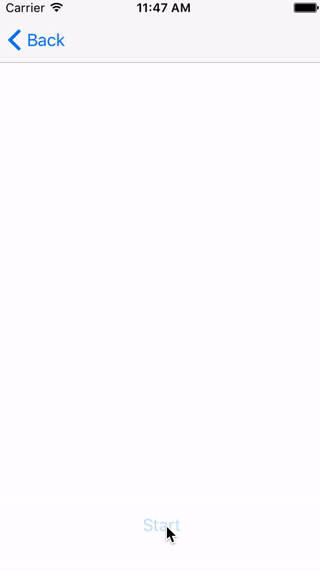

#  ProgressMaskView

**Progress Mask View** is a view which masks all screen to show a progress and an activity. You can disable user interaction while processing very easily.



This view has:
 - Circular activity view.
 - Circular progress view.
 - Label in center.
 - Dynamic Type capable.
 - Fit to all screen size.

Animation is implemented on CALayer. Lightweight.


## Easy to Use

1. Make a ProgressMaskView instance
2. Pass your UIViewController to the `install(to:)` method.
3. Call `showIn()` to start.

4. Set `progress` property like UIProgressView.

5. Call `hideIn(second:uninstall)` to complete.

## Customizable
 - Change colors.
 - Change Radius and Thickness.
 - Change activity rotation speed.

## Install
Get all code and buid it on Xcode to create ProgressMaskView.framework.

Select ProgressMaskView.framework to the Embedded Binaries on Project General.


## Sample

### Show

```Swift: UIViewController
private var maskView: ProgressMaskView?
    
    ...

@IBAction func onButtonTap(_ sender: Any) {
    guard maskView == nil else { return }

    maskView = ProgressMaskView()
    maskView?.title = "Processing..."
    maskView?.install(to: self)
    maskView?.showIn(second: 1.0)
        
    startYourProcess()
}
```

### Progress

```Swift
maskView?.progress = value // 0.0 - 1.0
```

### Hide

```Swift
maskView?.hideIn(second: 1.0, uninstall: true)
maskView = nil
```

## License
MIT License

## Welcome
Any comments, requests, contributions are welcome.
