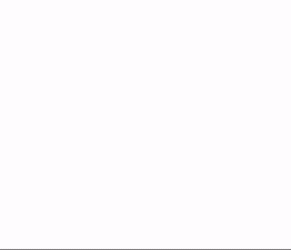
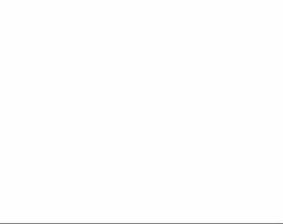

#  ProgressMaskView for iOS

**Progress Mask View** is a view which covers the entire screen to disable any user interaction including Tab bar items and navigation bar buttons. It shows an activity indicator and progress. User can aware that any interaction is disabled and he/she has to wait. Activity movement and color change are very beautiful.

Basically, you should not use this. Disabling user interaction is not a good idea as a recent modern app.
However, in some case, it is necessary. I created this view to use on a backup function and a restore function since it is not possible to change any data while it is backing up or restoring from the backup data. This view does not has any cancel button. If your function can be cancelled, you should not disable navigation bar nor tab bar.
You should use this at very limited case.

## Screenshots




## Features
This view has:
 - Circular activity view.
 - Circular progress view.
 - Label in center.
 - Transparent black effect covers all screen.
 
This is:
 - Light.
 - Dynamic Type capable.
 - Fit to all screen size.
 - Easy to use.

Animation is implemented at CALayer and it is lightweight.

## How to Use

It is recommended to use this view from a code.
This view automatically insert itself into the view hierarchy at beginning, and remove it at the end.

Start:
1. Make a `ProgressMaskView` instance.
2. Pass your UIViewController to the `install(to:)` method of the instance.
3. Call the `showIn()` method to show the progress view.

Update:
4. Specify the `progress` property like a UIProgressView to update UI.

End:
5. Call the `hideIn(second:uninstall)` method at the end.

That's all. This view automatically decide appropriate insert point in the view hierarchy and insert it, set up all constraint, and start animation. At the end, this view is removed from the tree so that it can be freed.

If you want, you can use Interface builder. But I suggest above code approach because it is easier.


## Customization
 - Change colors.
 - Change Radius and Thickness.
 - Change activity rotation speed.

## Installation

- Get all code.
- Add the ProgressMaskView.xcodeproj onto your project.
- Add ProgressMaskView.framework into the Embedded Binaries section at Project - Target - General.
- `import ProgressMaskView` will enable you to use ProgressMaskView.

## Sample Code

### Start

In your view controller;

```Swift

import ProgressMaskView

...

private var maskView: ProgressMaskView?
    
...

@IBAction func onButtonTap(_ sender: Any) {
    guard maskView == nil else { return }

    maskView = ProgressMaskView()
    maskView?.title = "Processing..."
    maskView?.install(to: self)
    maskView?.showIn(second: 1.0)
        
    startYourProcess()
}
```

### Set Progress

While processing, set progress value to ProgressMaskView to update display.

```Swift
maskView?.progress = progressValue // 0.0 - 1.0
```

### End

At the end, call `hideIn` method to discard the view.

```Swift
maskView?.hideIn(second: 1.0, uninstall: true)
maskView = nil
```

If uninstall is false, The Progress Mask View become hidden but remains in the view hierarchy. You can reuse it by calling `show(in:)` method.

## License
MIT License

## Thanks
Any comments, requests, contributions are welcome.
